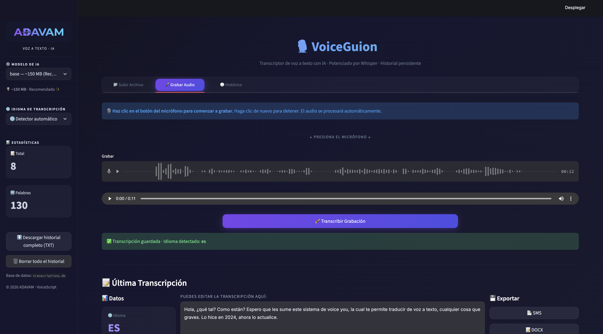

<div align="center">
  

  <br><br>

  # 🎙️ VoiceScript · by ADAVAM

  **Transcriptor de Voz a Texto con Inteligencia Artificial Local**

  [](https://www.python.org/downloads/)
  [](https://streamlit.io/)
  [](https://github.com/openai/whisper)
  [](https://ollama.com/)
  [](LICENSE)
</div>

<br>

**VoiceScript** es una aplicación de grado empresarial diseñada para extraer, procesar y refinar texto a partir de grabaciones de audio mediante IA local. Utiliza **OpenAI Whisper** para la transcripción de alta precisión y **Ollama (Llama 3.2)** para el post-procesamiento semántico (traducción, corrección ortográfica y resúmenes).

---

## 🌟 Características Principales

- **🎙️ Grabador Nativo con Visualizador**: Captura audio directamente desde el navegador con análisis visual de ondas (compatible nativamente desde Streamlit 1.34+).
- **🧠 Transcripción Multi-modelo**: Cambia entre modelos de Whisper (`tiny`, `base`, `small`, `medium`) según tus necesidades de velocidad vs. precisión.
- **🌍 Auto-detección de Idiomas**: Detecta el idioma hablado automáticamente o fíjalo para máxima precisión en más de 90 idiomas.
- **🤖 Post-procesamiento con Ollama**: Traduce al inglés, corrige gramática o extrae puntos clave utilizando un LLM alojado localmente.
- **💾 Exportación Multi-formato**: Descarga transcripciones en `TXT`, `DOCX` o `PDF`. ¡Incluye descarga masiva de todo tu historial!
- **🗃️ Base de Datos Local**: Persistencia completa del historial con SQLite3. Arquitectura orientada a la privacidad.

---

## 🏗️ Arquitectura (MVC)

El proyecto está diseñado bajo un modelo arquitectónico MVC (Modelo-Vista-Controlador) para garantizar escabilidad por desarrolladores desde nivel *Junior* a *Senior*.

```text
voice-to-text/
├── app.py                     # Punto de entrada y enrutador principal
├── models/
│   ├── database.py            # SQLite3 ORM y queries
│   └── config.py              # Tokens, variables de estado y constantes
├── controllers/
│   ├── audio_controller.py    # Procesamiento de audio y bindings de Whisper
│   ├── export_controller.py   # Lógica de renderizado PDF/DOCX/TXT
│   └── ai_controller.py       # Wrapper API local para Ollama
├── views/
│   └── styles.py              # Inyección de estilos CSS UI Premium
├── .env.test                  # Plantilla de variables de entorno (Sin claves)
└── requirements.txt           # Dependencias de Python
```

---

## 🚀 Guía de Instalación

### 1. Requisitos Previos

Antes de comenzar, asegúrate de tener instalado en tu sistema:
- **Python 3.9** o superior.
- **FFmpeg**: Requerido por Whisper para decodificar los audios.
  - **Mac (Homebrew)**: `brew install ffmpeg`
  - **Linux (Ubuntu)**: `sudo apt update && sudo apt install ffmpeg`
  - **Windows**: Descargar desde [ffmpeg.org](https://ffmpeg.org/download.html) o usar `winget install ffmpeg`.
- **Ollama** (Opcional, pero recomendado): Para habilitar las traducciones y mejoras de IA. Descargar desde [ollama.com](https://ollama.com/).

### 2. Clonar y Preparar el Entorno

```bash
# 1. Clonar el repositorio
git clone https://github.com/tu-usuario/voice-to-text.git
cd voice-to-text

# 2. Crear un entorno virtual (Recomendado)
python3 -m venv venv
source venv/bin/activate  # En Mac/Linux
# venv\Scripts\activate   # En Windows

# 3. Instalar las dependencias exactas
pip install -r requirements.txt
```

### 3. Configurar Variables de Entorno

Nunca subas tus claves privadas a GitHub. Hemos incluido un archivo `.env.test` de ejemplo.

1. Duplica el archivo `.env.test` y renómbralo a `.env`.
2. Completa los valores reales:

```env
OLLAMA_BASE_URL=http://localhost:11434/v1
OLLAMA_API_KEY=tu_api_key_aqui
OLLAMA_MODEL=llama3.2
```

> **Nota:** El archivo `.env` ya se encuentra excluido en el `.gitignore` por seguridad.

### 4. Ejecutar la Aplicación

```bash
streamlit run app.py
```
> La aplicación se abrirá automáticamente en tu navegador por defecto en `http://localhost:8501`.

---

## 🛠️ Para Desarrolladores (Dev Notes)

### Controladores y Dependencias
- **Whisper**: Si experimentas problemas de memoria RAM en entornos locales con pocos recursos, restringe la UI para utilizar únicamente el modelo `base`.
- **Ollama**: Si ocurre un error 404 de modelo no encontrado, debes descargar el modelo en tu máquina local ejecutando `ollama pull llama3.2` en una terminal aparte.
- **Fuentes (PDF)**: El módulo `export_controller.py` incluye lógica dinámica para cargar fuentes Tipográficas Unicode (`NotoSans-Regular.ttf`) que evita excepciones `FPDFUnicodeEncodingException` al exportar transcripciones en Árabe o Mandarín.

### UI Premium
- El CSS se inyecta directamente vía `st.markdown(unsafe_allow_html=True)` estructurado en `views/styles.py`. Evitar sobrescribir clases core de Streamlit (`.stApp`, `.block-container`) a menos que sea estrictamente necesario.

---

<div align="center">
  <p>Diseñado con ❤️ por ADAVAM</p>
</div>
